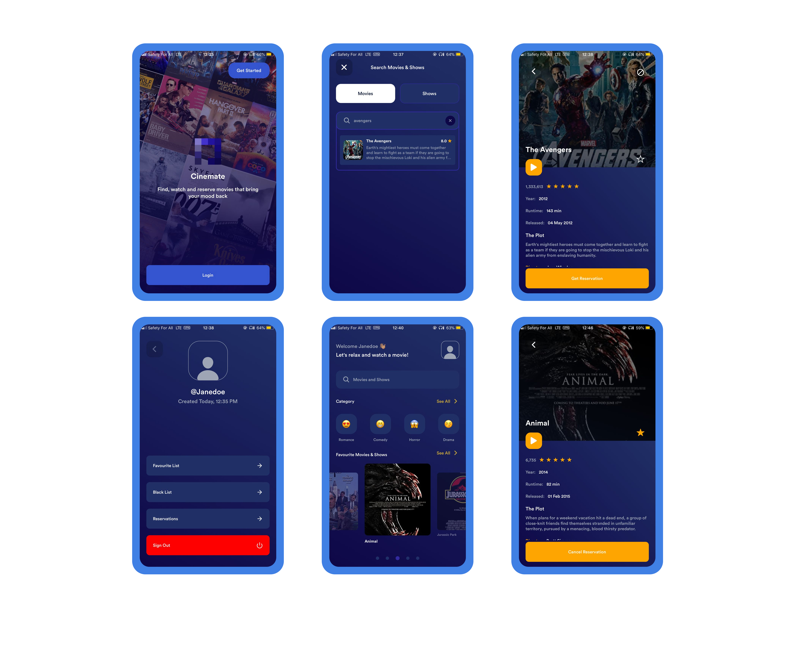

  
  <h3 align="center">Cinemate: Movies & Shows</h3>

---

  
  
  

Cinemate is your movie & series guide. Find, watch and reserve movies that bring your mood back. The fastest and easiest way to find Movies and Series on your device. Know about ratings, actors, writers, directors and plot from The Open Movie Database (OMDb).

## Architecture

Cinemate was built to run on particularly iOS and Android (not fully optimised for Web). It uses [Expo](https://expo.dev/) as a core lib to build and distribute to all the platforms.

### APIs

-Get the API-KEY (There is an existing one in the application already) [OMDb](https://www.omdbapi.com/apikey.aspx)

## Testing on your phone

You can download the app for android on [Cinemate Download](https://expo.dev/artifacts/eas/xzPdeZAmnypHogNpXMGmuT.apk).

## Contributing

Any bug reports, feature requests and other contributions are more than welcome!  
Whenever possible, please make a pull request with the implementation instead of just requesting it.

If the feature is big, open an issue first for discussion.

## Running locally

As others projects, you will need some requirements to run:

#### Requirements

- [Node.js](https://nodejs.org/) (latest)
- [Expo CLI](https://expo.dev/) (latest)
- [Yarn](https://yarnpkg.com/) (latest)

#### How to run

- `git clone git@github.com:vrinch/cinemate.git`
- `yarn install`

Now, you can choose a command to run the project:

- `expo start` to run on iOS or Android simulator
- `expo start --ios` to run on iOS or Android simulator only
- `expo start --android` to run on Android simulator only

## Deploying

Expo EAS provides simple ways to build and deploy your app with singles commands:

## 📝 License

Copyright © 2022 [VRINCH](https://github.com/vrinch). 
This project is [MIT](https://github.com/vrinch/cinemate/blob/main/LICENSE)
